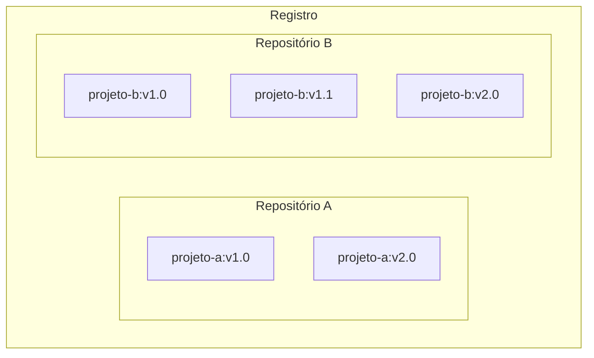



## Explicação

Agora que você sabe o que é uma imagem de contêiner e como ela funciona, você
pode se perguntar: onde você armazena essas imagens?

Bem, você pode armazenar suas imagens de contêiner no seu computador, mas e se
você quiser compartilhá-las com outras pessoas ou usá-las em outra máquina?
É aí que entra o registro de imagens.

Um registro de imagens é um local centralizado para armazenar e compartilhar
suas imagens de contêiner.
Ele pode ser público ou privado.
O [Docker Hub](https://hub.docker.com) é um registro público que qualquer pessoa
pode usar e é o registro padrão.

Embora o Docker Hub seja uma opção popular, existem muitos outros registros de
contêiner disponíveis atualmente, incluindo
[Amazon Elastic Container Registry (ECR)](https://aws.amazon.com/ecr/),
[Azure Container Registry (ACR)](https://azure.microsoft.com/en-in/products/container-registry)
e [Google Container Registry (GCR)](https://cloud.google.com/artifact-registry).
Você pode até mesmo executar seu registro privado em seu sistema local ou na sua
organização.
Por exemplo, Harbor, JFrog Artifactory, GitLab Container Registry, etc.

### Registro vs. repositório

Ao trabalhar com registros, você pode ouvir os termos _registro_ e _repositório_
como se fossem intercambiáveis.
Embora estejam relacionados, não são o mesmo.

Um _registro_ é um local centralizado que armazena e gerencia imagens de
contêiner, enquanto um _repositório_ é uma coleção de imagens de contêiner
relacionadas em um registro.
Pense nele como uma pasta onde você organiza suas imagens com base em projetos.
Cada repositório contém uma ou mais imagens de contêiner.

O diagrama a seguir mostra o relacionamento entre um registro, repositórios e
imagens.



> [!TIP]
>
> O plano Docker Personal oferece um repositório privado e repositórios públicos
> ilimitados.
> Para obter repositórios privados ilimitados, atualize para o
> [plano Docker Team](https://www.docker.com/pricing?ref=Docs&refAction=DocsConceptsRegistry).

## Experimente

Nesta prática, você aprenderá como construir e enviar uma imagem Docker para o
repositório do Docker Hub.

### Crie uma conta gratuita do Docker

1. Se você ainda não criou uma, acesse a página do
   [Docker Hub](https://hub.docker.com) para criar uma nova conta do Docker.
   Certifique-se de concluir os passos de verificação enviados para o seu
   e-mail.

   

   Você pode usar sua conta do Google ou GitHub para autenticar.

### Crie seu primeiro repositório

1. Faça o login no [Docker Hub](https://hub.docker.com).
2. Selecione o botão **Create repository** no canto superior direito.
3. Selecione seu namespace (provavelmente seu nome de usuário) e digite
   `docker-quickstart` como nome do repositório.

   

4. Defina a visibilidade como **Public**.
5. Selecione o botão **Create** para criar o repositório.

Pronto.
Você criou seu primeiro repositório com sucesso. 🎉

Este repositório está vazio no momento.
Agora você pode corrigir isso enviando uma imagem para ele.

### Faça o login com o Docker Desktop

1. [Baixe e instale](https://www.docker.com/products/docker-desktop/) o Docker
   Desktop, caso ainda não esteja instalado.
2. Na GUI do Docker Desktop, selecione o botão **Sign in** no canto superior
   direito.

### Clone o código Node.js de exemplo

Para criar uma imagem, primeiro você precisa de um projeto.
Para começar rapidamente, você usará um projeto Node.js de exemplo encontrado em
[github.com/dockersamples/helloworld-demo-node](https://github.com/dockersamples/helloworld-demo-node).
Este repositório contém um Dockerfile pré-construído necessário para a criação
de uma imagem Docker.

Não se preocupe com os detalhes do Dockerfile, pois você aprenderá sobre isso
nas seções posteriores.

1. Clone o repositório GitHub usando o seguinte comando:

   ```console
   git clone https://github.com/dockersamples/helloworld-demo-node
   ```

2. Navegue até o diretório recém-criado:

   ```console
   cd helloworld-demo-node
   ```

3. Execute o seguinte comando para criar uma imagem Docker, trocando
   `SEU_NOME_DE_USUARIO` pelo seu nome de usuário.

   ```console
   docker build -t <SEU_NOME_DE_USUARIO>/docker-quickstart .
   ```

   > [!NOTE]
   >
   > Certifique-se de incluir o ponto (.) no final do comando `docker build`.
   > Isso informa ao Docker onde encontrar o Dockerfile.

4. Execute o seguinte comando para listar a imagem Docker recém-criada:

   ```console
   docker images
   ```

   Você verá uma saída como a seguinte:

   ```console
   REPOSITORY                                 TAG       IMAGE ID       CREATED         SIZE
   <SEU_NOME_DE_USUARIO>/docker-quickstart    latest    476de364f70e   2 minutes ago   170MB
   ```

5. Inicie um contêiner para testar a imagem executando o seguinte comando
   (troque o nome de usuário pelo seu próprio nome de usuário):

   ```console
   docker run -d -p 8080:8080 <SEU_NOME_DE_USUARIO>/docker-quickstart
   ```

   Você pode verificar se o contêiner está funcionando visitando
   [http://localhost:8080](http://localhost:8080) com o seu navegador.

6. Use o comando [`docker tag`](/reference/cli/docker/image/tag/) para adicionar
   uma tag à imagem Docker.
   As tags do Docker permitem que você rotule e versione suas imagens.

    ```console
    docker tag <SEU_NOME_DE_USUARIO>/docker-quickstart <SEU_NOME_DE_USUARIO>/docker-quickstart:1.0
    ```

7. Finalmente, é hora de enviar a imagem recém-criada para o seu repositório do
   Docker Hub usando o comando
   [`docker push`](/reference/cli/docker/image/push/):

   ```console
   docker push <SEU_NOME_DE_USUARIO>/docker-quickstart:1.0
   ```

8. Abra o [Docker Hub](https://hub.docker.com) e navegue até o seu repositório.
   Navegue até a seção **Tags** e veja a imagem recém-enviada.

   

Neste passo a passo, você criou uma conta do Docker, criou seu primeiro
repositório do Docker Hub e construiu, adicionou uma tag e enviou uma imagem de
contêiner para seu repositório do Docker Hub.

## Recursos adicionais

- [Início rápido do Docker Hub](/docker-hub/quickstart/)
- [Gerencie repositórios do Docker Hub](/docker-hub/repos/)

## Próximos passos

Agora que você entende os conceitos básicos de contêineres e imagens, pode
aprender sobre o Docker Compose.


